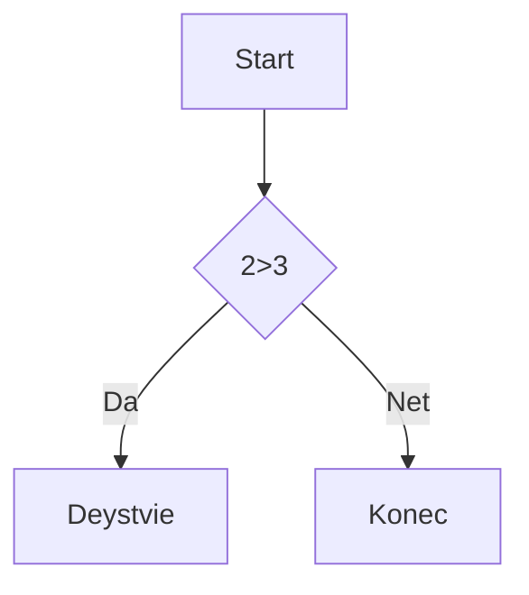

# ЗАголовока 1
## ЗАголовока 2
### ЗАголовока 3
#### ЗАголовока 4
##### ЗАголовока 5
###### ЗАголовока 6

Выделения проходили

*Кусирв* / _Кусив_

**Жирбас** / __ЖИРБАС__

***Жирный и кусив*** / ___Жирный и кусив___

~~Жирный и кусив~~
~~Жирный и кусив~
`момо код`

списски
---------

- пункт 1
- пункт 2
  - вож
  - еще
* пункт 3
* пункт 4

1. Первый
2. Второй
3. Третий
   1. Вож
   2. еще

- [x] 1
- [ ] 2
- [ ] 3

Ссылки
-------

[текст ссылки](https://www.youtube.com/watch?v=dQw4w9WgXcQ)

[Текст с подсказкой](https://www.youtube.com/watch?v=dQw4w9WgXcQ "При наведении")

<https://www.youtube.com/watch?v=dQw4w9WgXcQ>

[Ссылочный стиль][1]

[1]: https://www.youtube.com/watch?v=dQw4w9WgXcQ
sdsdsdsdsd

Картинки
-------


[](https://encrypted-tbn0.gstatic.com/images?q=tbn:ANd9GcSGjzTxBs5EsvmZpTRkAaR8J0qHYLYNCQtQ3WJKkg9w6xjJHSPreExFq-L5&s=10)

Цитата
-----

>Цитата
>Много срок
>
>  > Влож

Код
---

```markdown
print("Hello") Python
```

```python
c =a+b
print(f{c} = {a} + {b}")
```

Таблицы
-------
---: = ориентация справа

:---: = ориентация справа

:--- = ориентация справа

| Name        | Age | Otso city      |
|------------:|:---:|:---------------|
|Matvey Bodyak| 19  |Rostovskaya 19 B|
|Matvey Bodyak| 19  |Rostovskaya 19 B|
|Matvey Bodyak| 19  |Rostovskaya 19 B|
|Matvey Bodyak| 19  |Rostovskaya 19 B|
|Matvey Bodyak| 19  |Rostovskaya 19 B|
|Matvey Bodyak| 19  |Rostovskaya 19 B|

Линии
-----

---
***
___

Экранирование
-------------

\# fdf

\[ dsdsd \]
Диаграмма 
---------



Заголовки
---------

- [Заголовки](#1-заголовки)
- [Списки](#3-списки)
